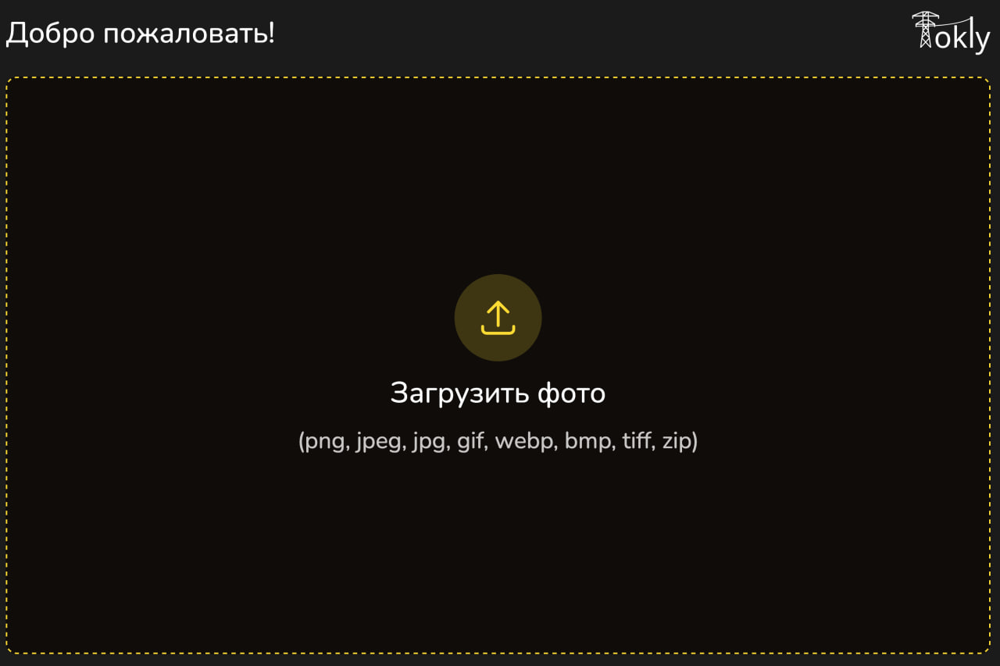
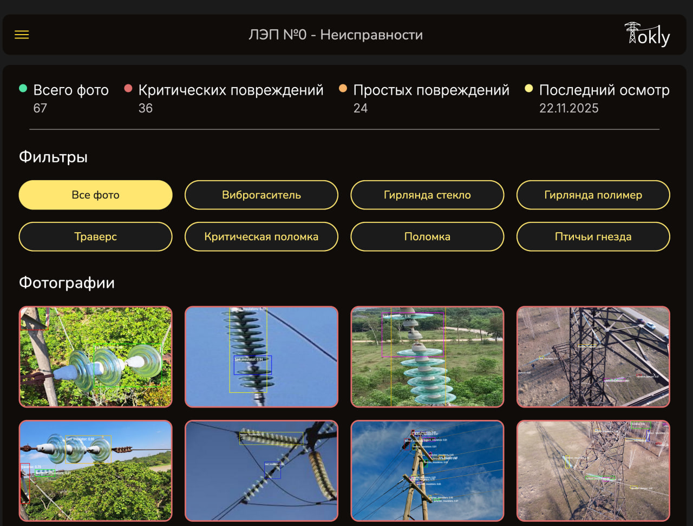
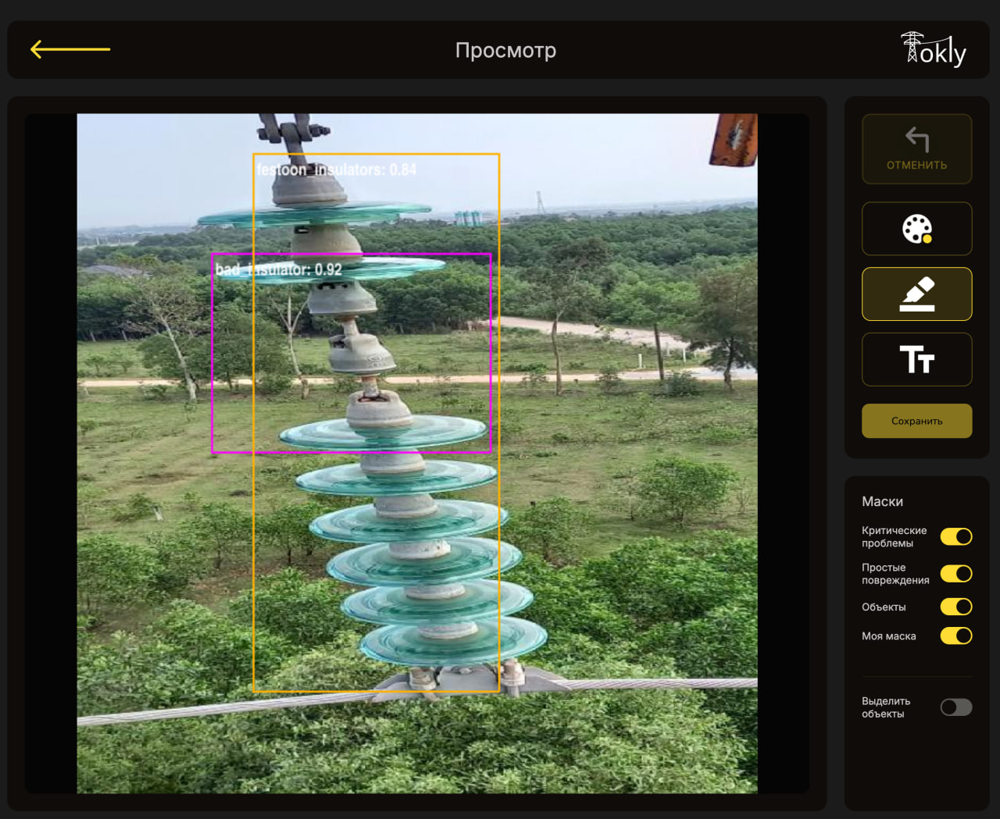
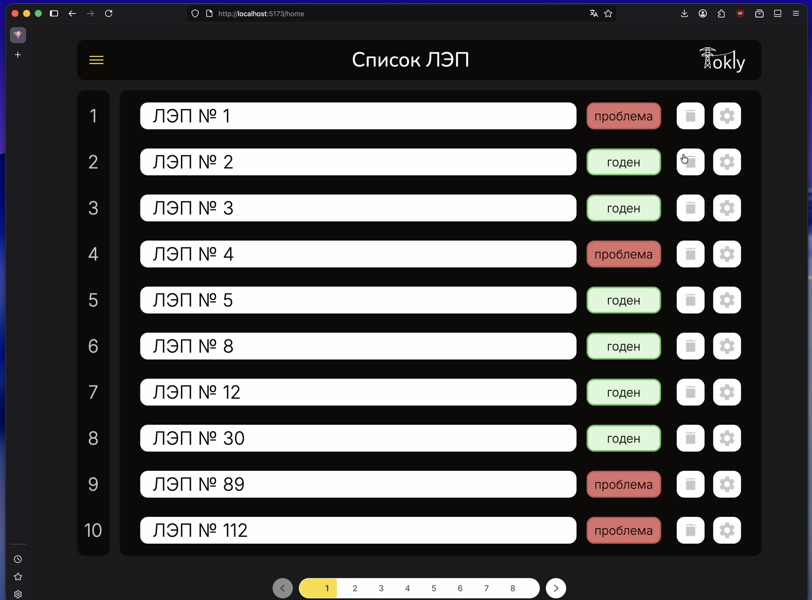
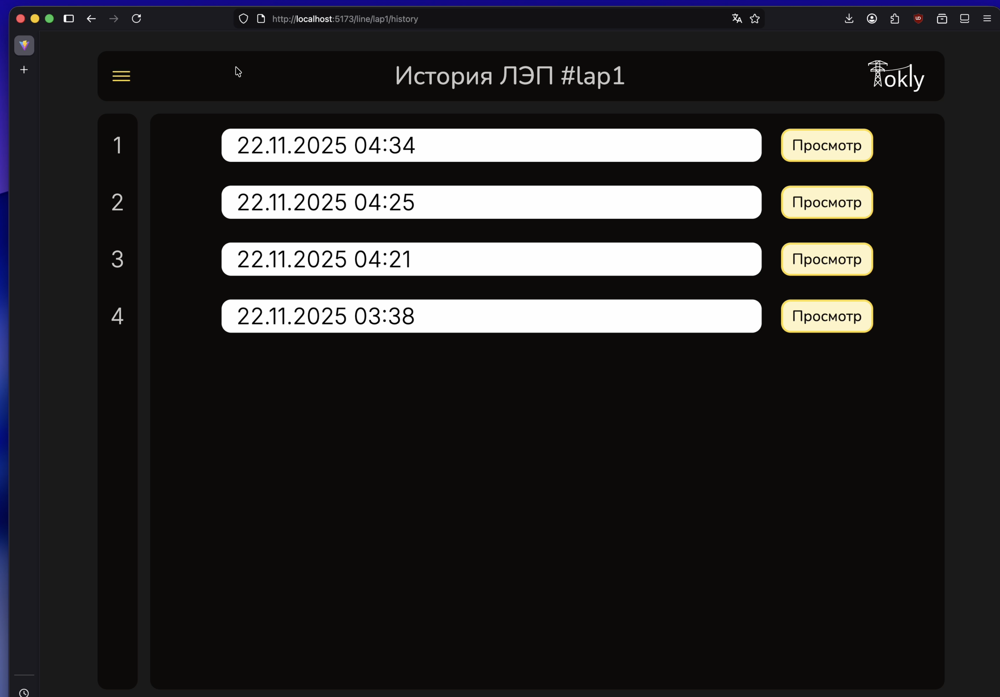

# Tokly App

МПИТ Окружной Финал 2025.

Веб-приложение для мониторинга состояния виброгасителей изоляторов и траверсов на линиях электропередачи (ЛЭП).

## 📋 Техническое задание

Полное техническое задание от компании доступно в файле:
[`docs/Kejs_Monitoring_sostoyaniya_vibrogasitelej_izolyatorov_i_traversov.pdf`](./docs/Kejs_Monitoring_sostoyaniya_vibrogasitelej_izolyatorov_i_traversov.pdf)

## 🎬 Промо-ролик

Промо-ролик приложения:
[`docs/tolky-app.mov`](./docs/tolky-app.mov)

## 📸 Скриншоты приложения

### Главная страница (Загрузка фотографий)


### Просмотр обработанных нейросетью фотографий


### Редактор фотографий


### Список ЛЭП


### История


## 🚀 Быстрый старт

### Установка зависимостей

```bash
npm install
```

### Запуск в режиме разработки

```bash
npm run dev
```

Приложение будет доступно по адресу `http://localhost:5173`

### Сборка для продакшена

```bash
npm run build
```

### Предпросмотр продакшен-сборки

```bash
npm run preview
```

## 🛠 Технологии

- **React 19** - UI библиотека
- **TypeScript** - типизация
- **Vite** - сборщик и dev-сервер
- **React Router** - маршрутизация
- **Styled Components** - стилизация компонентов
- **JSZip** - работа с архивами

## 📁 Структура проекта

```
tokly-app/
├── src/
│   ├── components/      # React компоненты
│   ├── pages/          # Страницы приложения
│   ├── services/        # API сервисы
│   ├── styles/         # Глобальные стили
│   ├── assets/         # Статические ресурсы
│   └── constants/      # Константы
├── docs/               # Документация, ТЗ, скриншоты, видео
└── public/             # Публичные файлы
```
